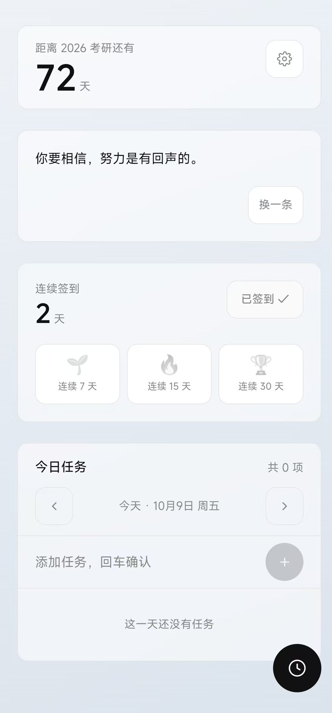
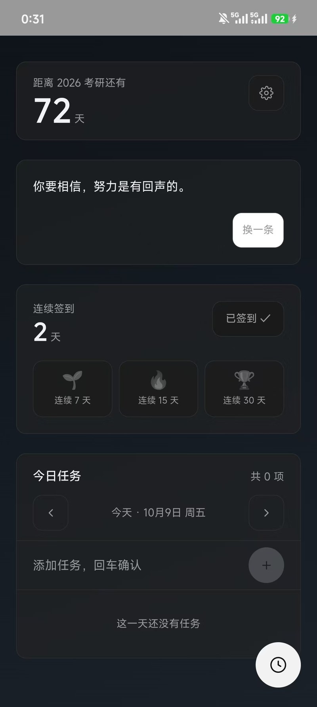
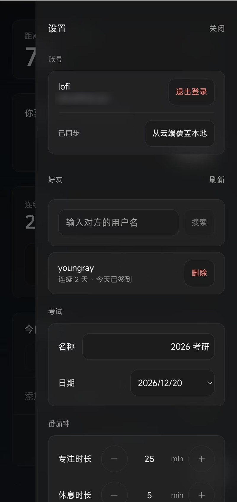

# 考研打卡

一个给自己每天用的**考研倒计时打卡 PWA**。

从「纯本地存储」一路做到「账号登录 + 好友互相监督 + 离线优先云同步」，中间踩的坑都记在下面。

- **线上地址**：https://lofi-fifi.github.io/guyue/
- **技术栈**：React 19 · TypeScript · Tailwind CSS 4 · Vite · Supabase (PostgreSQL) · PWA
- **规模**：57 个文件 / 约 7500 行 TypeScript（其中 8 个测试文件、**227 条断言**）/ 5 张数据库表

---

| 主界面 | 深色模式 | 好友 |
|---|---|---|
|  |  |  |

## 功能

**打卡**
- 考研倒计时（`距离 2026 考研还有 XX 天`）
- 每日鸡汤（内置 100 条，可自定义）
- 今日签到 · 连续签到天数 · 7/15/30 天徽章（30 天可重复获得并叠加）
- **节日彩蛋**：倒计时下面一行小字，全年约 25 天。国庆、春节、中秋、七夕、倒计时 100 天……
  农历用 `Intl` 原生算，**不写死日期**，明年后年也自动准

**任务**
- 按天记录，点任意处切换完成，完成的沉到底部
- 计时、补录时长、长按重命名、删除（带 3 秒撤销）

**番茄钟**
- 25/5 分钟（可调），大号等宽倒计时，标签页标题同步显示剩余时间
- 可关联到具体任务，专注时长自动累加
- **上下滑动倒计时直接调时长**（只影响本次，不写回设置）
- 提示音 + 震动

**日记**
- 底部 Tab 切到**完全独立的一屏**，不塞进主页也不塞进设置面板
- **全屏沉浸式书写**（不是弹窗）：无边框输入框、行高 1.9、留白拉满
- 日期 + 心情 emoji + 正文；列表按日期倒序，显示日期、心情、两行摘要
- 纯手动书写，**没有任何 AI 生成**；存本地 + 云端同步（换设备能看到）

**外观**
- 4 套低饱和度内置渐变，或上传自己的图片（最多 5 张，自动压缩到 1920px）
- **每日随机背景**：以本地日期为种子，同一天永远同一张，相邻两天必不相同
- 卡片毛玻璃透明度可调
- **深浅色模式**：跟随系统 / 浅色 / 深色

**账号与好友**
- 邮箱注册登录（Supabase Auth）
- 按用户名搜索加好友、同意 / 拒绝、删除
- 看好友的连续天数、今天签没签到、今日任务完成数

**同步**
- 本地优先：改完停手 1.5 秒自动推送，断网就排队，联网或每 20 秒重试
- **打开应用时自动拉一次**：另一台设备写的东西能直接看到
- 本地还有没推上去的改动时，**先推再拉**，不会被云端盖掉
- 两边的日记按 id 合并 —— 电脑和手机各写一篇，两篇都在

**数据**
- 导出 / 导入 JSON 备份
- 生成今日进度卡片复制到剪贴板

**PWA**
- 可安装到主屏幕、离线可用（Service Worker 预缓存）

---

## 架构

```
src/
├── lib/          纯逻辑，不碰 DOM / 网络 —— 全部可单测
│   ├── date.ts         本地时区日期运算（不用 toISOString，见下方踩坑）
│   ├── checkin.ts      连续签到天数、徽章判定
│   ├── diary.ts        日记排序、摘要、日期标签
│   ├── holiday.ts      节日彩蛋：农历换算 + 命中判定
│   ├── pomodoro.ts     番茄钟状态机（纯 reducer）
│   ├── sync.ts         本地数据 ⇄ 数据库行、差异计算、变更指纹
│   ├── background.ts   背景预设、每日随机算法
│   └── storage.ts      AppData 类型 + 读写 + 脏数据归一化
├── utils/        浏览器 / 第三方 API 的封装
│   ├── supabase*.ts    客户端、认证、好友、同步
│   ├── feedback.ts     提示音（Web Audio）+ 震动
│   ├── theme.ts        深浅色落到 DOM
│   └── image.ts        图片压缩
├── hooks/        有状态逻辑
├── components/   纯展示
└── data/         静态内容
    ├── quotes.ts      100 条鸡汤
    └── holidays.ts    节日彩蛋文案（加节日只改这一个文件）
```

**为什么这样分层**：`lib/` 里的东西不依赖任何浏览器 API，所以能直接扔进 Node 跑测试。这个决定后来回报很大 —— 番茄钟状态机、连续天数算法、同步差异计算这三块最容易出 bug 的部分，都有完整的单元测试覆盖。

---

## 几个值得说的技术点

### 1. RLS 策略互相引用导致的无限递归

好友可见性需要「判断两个人是不是好友」，而 `profiles` 的 RLS 策略里要查 `friendships` 表：

```sql
-- ❌ 这样写会直接报错
create policy profiles_select on profiles using (
  exists (select 1 from friendships f where ...)
);
```

Postgres 报 `infinite recursion detected in policy for relation "friendships"` —— 因为查 `friendships` 又会触发 `friendships` 自己的策略。

**解法**：把判断逻辑包进 `SECURITY DEFINER` 函数。它以**函数属主**身份运行、绕过 RLS，从而切断递归链；同时把 `where` 条件锁死成「只能查和我有关的行」，不会泄露别人的数据。

### 2. 「今日是否已签到」不能存布尔值

最初设计是 `profiles.checked_today boolean`。问题是：**过了零点它不会自己变回 false**，第二天用户会发现自己签不了到。

改成存 `last_checkin_date date`，由客户端判断 `last_checkin_date == 我本地的今天`。日期是客观事实，永远不会过期。

### 3. RLS 管行，管不了列 —— 统计值会被篡改

既然要「互相监督」，好友看到的连续天数就必须是真的。但 RLS 只能控制**哪些行**能改，控制不了**哪些列**：

```sql
-- 用户可以直接 update profiles set streak = 999
```

**解法**：列级授权。

```sql
revoke update on public.profiles from authenticated;
grant  update (username) on public.profiles to authenticated;
```

`streak` / `last_checkin_date` 改由**数据库触发器**维护 —— 签到表一有变化就自动重算。这样客户端连写都写不进去，统计值天然可信。

### 4. PostgREST 的 UPDATE 会「静默失败」

PostgREST 里，UPDATE / DELETE 如果匹配到 **0 行**（被 RLS 挡了、或者记录已经不在了），返回的是 `204` 而且 **`error` 是 `null`**：

```ts
// ❌ 什么都没改，却报成功
const { error } = await supabase.from('friendships').update({...}).eq('id', id)
if (error) return failure(error)
return { ok: true }
```

表现就是：界面上提示「已发出好友申请」，数据库里其实什么都没有。

**解法**：要求把改到的行返回，然后检查条数。

```ts
const { data, error } = await supabase
  .from('friendships').update({...}).eq('id', id).select('id')

if (error) return failure(error)
if (!data || data.length === 0) return { ok: false, message: '这条记录已经不在了' }
```

### 5. 换设备首次同步会把云端数据删光

离线同步的推送逻辑是「先 upsert 本地的，再删掉云端多出来的行」，用来同步删除操作。但 `云端有、本地没有 → 删掉` 这个判断有个致命缺陷：

> 你在手机上加了 10 件任务同步上去了，几天后在电脑上第一次打开应用 ——
> 电脑本地一个任务都没有，于是**那 10 件全被删干净**。

**解法**：只删「**本地确实编辑过的日期**」里云端多出来的行。

```ts
const touched = new Set(local.map((row) => row.date))
return cloud.filter((row) => touched.has(row.date) && !keep.has(row.id))
```

> 这里还有个后续 bug：一开始我用「本地任务行」推导「碰过哪些日期」，但**一天的任务被删光时，那天在本地一行都不剩**，导致「删掉当天最后一件任务」同步不出去。改成从 `Object.keys(data.tasks)` 取 —— `removeTask` 只过滤数组，日期的 key 会保留（值是空数组）。

### 6. 每日随机背景「相邻两天可能撞车」

要求是「同一天永远同一张 + 第二天一定换一张」。第一版写成「今天哈希一下，和昨天的**原始哈希**比，撞了就挪一格」——

但它没考虑**昨天自己可能也被挪过**。当连续三天的原始哈希相同时，第二天和第三天会算出同一张。

**解法**：从固定起点逐日推演，比的始终是**最终结果**：

```
raw != current  →  current' = raw          （必不相同）
raw == current  →  current' = (raw+1) % n  （n≥2 时必不相同）
```

测试覆盖连续 365 天 × 4 种图片数量，**逐日断言与前一天不同**。

### 7. 时区：日期绝不能交给服务器算

Supabase 服务器是 UTC。如果让服务器决定「今天」，那北京时间早上 8 点前都算成昨天 —— 凌晨 1 点签的到会记到前一天。

**解法**：日期一律由客户端按本地时区算好（`YYYY-MM-DD`，不用 `toISOString()`），服务器只负责存和比较。

### 8. 加一件任务不该重传 2MB 背景图

设置里可能塞着上兆的背景图 Base64。如果把「任务 + 签到 + 设置」合成一个变更指纹，那么每加一件任务都会把整份设置重传一遍。

**解法**：拆成两个独立指纹，各自判断要不要推。

- `tasksFingerprint` —— 任务 + 签到，数据很小
- `settingsFingerprint` —— 设置 + 徽章；背景图只取「长度 + 头尾各 24 字符」参与指纹，既能区分不同的图，又不用序列化几兆字符串

### 9. 深色模式：只覆盖 CSS 变量

所有颜色都走 Tailwind 的 CSS 变量（`--color-ink` 等），所以换肤只需要覆盖变量：

```css
:root[data-theme='dark'] {
  --color-ink: #f2f2f2;
  --color-panel: #1c1c1c;
  --card-rgb: 36 36 36;   /* 卡片毛玻璃的基色 */
}
```

**13 个组件文件里一行样式都没改。**

顺带处理的两个细节：

- **危险色拆成两个**：深色下 `#d92d20` 当文字色太暗（在近黑底上只有 3.5:1），但当按钮底又需要够暗才能压住白字 —— 一个值做不到两边都达标。
- **首屏防白闪**：在 `index.html` 里内联一段前置脚本，React 挂载前就把 `data-theme` 定下来。主题单独存一个小 key，**不去解析那个可能上兆的 `kaoyan-app-data`**。

### 10. 节日彩蛋：农历不能手写日期表

春节、端午、中秋、七夕每年都在飘。手写一张 2025–2030 的对照表，过两年就失效，而且很容易抄错。

用 `Intl.DateTimeFormat('zh-CN-u-ca-chinese')` 让运行时自己算，`formatToParts` 还能拆成结构化字段，不依赖各浏览器的输出格式：

```ts
new Intl.DateTimeFormat('zh-CN-u-ca-chinese', { month: 'long', day: 'numeric' })
  .formatToParts(new Date(2026, 1, 17))
// → [{ month: '正月' }, { day: '1' }, { literal: '日' }]
```

两个坑：

- **月份名要归一化**：不同浏览器给的写法不一样（「正月」/「一月」、「腊月」/「十二月」），直接比字符串会漏。
- **闰月必须显式排除**：闰四月初四不是四月初四，代码里看到「闰」直接返回 null。

另外整个农历模块都包在 `try/catch` 里 —— 极少数没编 ICU 的环境里构造会失败，**彩蛋不该让应用崩掉**，静默跳过就是。

### 11. 云同步会把日记清空

日记只存在本地，云端没有这个字段。而 `useSync` 拉云端数据时是**整体替换本地**：

```ts
const next = normalizeData({ tasks, checkins, badges, dayTotals, settings })
//                                              ↑ 没有 diaries
```

`normalizeData` 会把缺失的 `diaries` 补成 `[]` —— 于是**一次同步就把所有日记清空了**，而且界面上不会有任何提示。

当时的解法是在拉取时显式带上本机日记：

```ts
diaries: dataRef.current.diaries,
```

后来给日记加了云端同步，就换成了正经做法：

- **一列 jsonb**：user_settings.diaries（日记一直是整体读写，不需要一张表）
- **第三个独立指纹** diariesFingerprint：写日记只更新这一列，不会捎带上可能几兆的背景图
- 拉取时用 cloud.diaries ?? 本机的 —— 云端还没写过日记的设备不会把本机的冲掉

**这类「A 模块新增了字段，B 模块负责整体替换」的 bug，只有把两个模块放在一起想才会发现。**

### 12. 打开应用时，到底该推还是该拉？

给日记加完同步，另一个问题浮出来了：**电脑写的日记，手机看不到** —— 因为最初的同步策略是「首次同步拉一次，之后只推不拉」。这在单设备下没问题，两台设备用就立刻难受。

想改成「打开就拉一次」，但要解决一个关键问题：**怎么知道本地有没有还没推上去的改动？** 有的话就不能直接拉，否则「在地铁上离线写的日记」一联网就被云端盖掉 —— 这正是当初不做自动拉取的原因。

第一反应是比指纹，但**指纹在这里不够用**：它在页面加载的那一刻就记成了当前值，分不清「本地这批数据已经推过了」和「本地这批数据还没推过」。

所以必须把这个状态**持久化**下来：

```ts
localStorage['kaoyan-dirty-<userId>'] = '1'   // 有改动时置位
localStorage.removeItem(...)                  // 推送成功后清除
```

于是打开应用时就能安全地分岔：

| 标记 | 含义 | 动作 |
|---|---|---|
| 干净 | 本地没有没推的东西 | **直接拉** |
| 脏 | 本地有没推的东西 | **先推，再拉** |

两个细节：

- **标记要在排防抖计时器之前写**。否则用户在那 1.5 秒里关掉页面，改动就变成「本地有、云端没有、而且没人知道」。
- **读不到标记时保守地当成「脏」**。宁可多推一次，也不能把没推的东西拉掉。

另外日记的拉取改成了**按 id 合并**而不是整体覆盖 —— 这样两台设备各写一篇，合并后**两篇都在**。任务不能这么合，原因见「已知局限」。

---

## 数据库设计

5 张表：

| 表 | 作用 | 好友可见 |
|---|---|---|
| `profiles` | 用户名、连续天数、最后签到日期 | ✅ 部分字段 |
| `friendships` | 好友关系（一对用户只能有一条，不分方向） | — |
| `checkins` | 签到记录，`unique(user_id, date)` | ✅ |
| `tasks` | 任务，主键用**客户端生成的 UUID** | ✅ |
| `user_settings` | 设置 / 徽章 / 未关联时长 / **日记** | ❌ 仅自己 |

**为什么 `settings` 要单独一张表**：`profiles` 好友可读（需要看用户名和连续天数），但设置里有自定义语录、考试日期这些私人内容。RLS 只能按**行**授权、不能按**列**区分好友和自己，所以必须拆表。

建表和迁移 SQL 在 `supabase/` 目录，**按顺序执行**：

| 文件 | 内容 |
|---|---|
| `001-init.sql` | `profiles` / `friendships` / `checkins` + 触发器 + 全部 RLS 策略 |
| `002-tasks-and-friends.sql` | `tasks` / `user_settings`，好友可见性调整 |
| `003-friends-rpc.sql` | `list_my_friendships` 函数（让待确认请求能显示对方名字） |
| `004-diaries-sync.sql` | `user_settings` 加 `diaries` 列 |

**为什么日记是「一列」而不是「一张表」**：日记一直是整体读写的 —— 不像任务要按行增删、排序、算差异。一列 `jsonb` 读写都只要一次往返，也不用再写一套 RLS 策略。哪天想让日记支持按行搜索、或者给好友看，再拆表也不迟。

---

## 本地运行

```bash
pnpm install
pnpm dev          # http://localhost:5173
```

需要在项目根目录建 `.env.local`（已被 `.gitignore` 挡着）：

```
VITE_SUPABASE_URL=https://xxxxx.supabase.co
VITE_SUPABASE_ANON_KEY=sb_publishable_xxxxxxxx
```

> ⚠️ **只填 publishable key**。`sb_secret_` / `service_role` 会绕过全部 RLS，绝不能进前端。

**没有配这两个值也能跑** —— 应用会退化成纯本地版，登录和好友入口自动隐藏。

完整的 Supabase 配置步骤见 [`SUPABASE.md`](SUPABASE.md)。

## 测试

```bash
pnpm test        # 跑一次
pnpm test:watch  # 监听模式
```

**8 个测试文件 / 227 条断言。** 只覆盖 `src/lib/` 里的纯逻辑 —— 那里不依赖任何浏览器 API，所以能直接在 Node 里跑，不需要 jsdom、不需要 mock fetch。

| 文件 | 覆盖什么 |
|---|---|
| `date.test.ts` | 本地时区（不用 `toISOString`）、跨月跨年跨闰年、跨夏令时 |
| `checkin.test.ts` | 连续签到天数、7/15/30 天徽章判定、🏆 可叠加 |
| `pomodoro.test.ts` | 状态机：时段切换、暂停恢复、停止记账、tick 迟到丢弃、滑动调时长的边界 |
| `background.test.ts` | 每日随机（365 天 × 4 种图片数量逐日断言）、深浅渐变用亮度公式验、模糊联动 |
| `sync.test.ts` | 差异删除的日期过滤、两个指纹互相独立、往返一致 |
| `storage.test.ts` | 脏数据兜底、越界夹取、导入防护、日记归一化 |
| `diary.test.ts` | 排序稳定性（不改原数组）、摘要压换行/截断、今天/昨天/同年/跨年日期标签 |
| `holiday.test.ts` | 农历换算（春节/端午/中秋/七夕/元宵）、闰月排除、撞车优先级、考研倒计时跟随考试日期 |

### 测试抓到的真 bug

写完测试第一次跑，挂了 4 条 —— 全是**归一化层没校验日期 key**：

```
checkins:  ['2026-10-08', '不是日期', '', '2026-13-99']
        →  ['2026-10-08', '不是日期', '', '2026-13-99']   ← 脏数据全留着
```

这不只是「数据难看」：`checkinsToRows()` 会把这些字符串**原样发给 Postgres 的 `date` 列**，只要混进去一个非法值，整批 upsert 就报 `invalid input syntax for type date`，**同步会一直卡住推不上去**。

修法是让 `normalizeCheckins` / `normalizeTasks` / `normalizeDayTotals` 都用 `isValidDateKey` 过滤，顺带把 `isValidDateKey` 的签名从 `(key: string)` 改成 `(key: unknown): key is string` —— 它本来就要处理从 JSON 读回来的脏值，写成类型守卫更诚实。

## 部署

GitHub Actions 自动构建并发布到 GitHub Pages（`.github/workflows/deploy.yml`）。

需要在仓库 **Settings → Secrets and variables → Actions** 里配两个 secret，否则线上版本拿不到 Supabase 配置：

| Name | 值 |
|---|---|
| `VITE_SUPABASE_URL` | 项目地址 |
| `VITE_SUPABASE_ANON_KEY` | publishable key |

## 已知局限

- **任务和签到是 last-write-wins**：日记已经能按 id 合并了，但任务不行 —— 任务有「删除」这个动作，没有墓碑就分不清「从没同步过」和「已经删了」，并集会把删掉的复活。要做到那就得引入软删除标记，工作量不小。
- **好友状态不是实时的**：打开设置面板时会拉取，面板开着时每 15 秒轮询一次。要做到「好友一签到立刻跳」需要接 Supabase Realtime。
- **删除签到不会同步**：应用本身没有「取消签到」功能，所以云端签到记录只增不删。
- **单人验证**：没有经过多人并发场景的验证。

## 技术栈

React 19 · TypeScript 5.9 · Tailwind CSS 4（CSS-first `@theme`）· Vite 8 · Supabase（PostgreSQL + Auth + RLS）· vite-plugin-pwa · GitHub Actions
